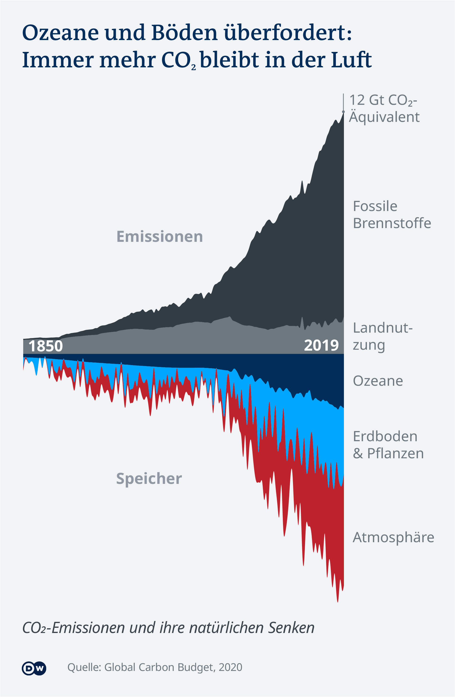
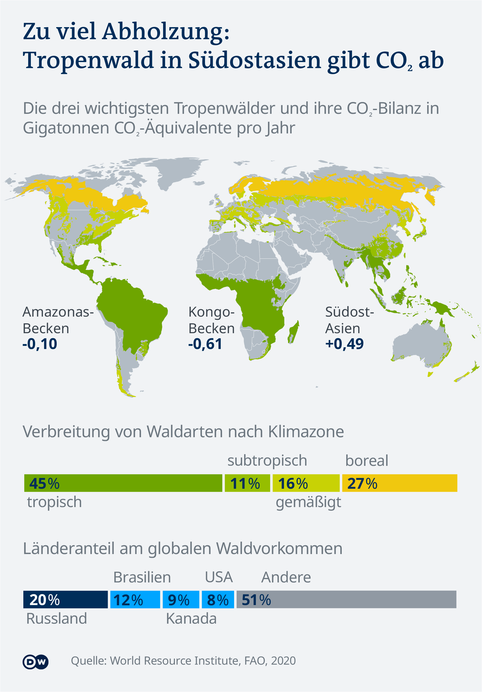
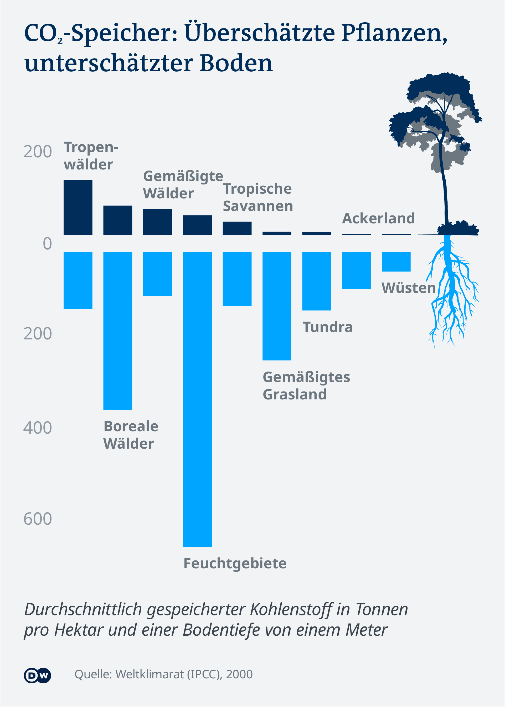
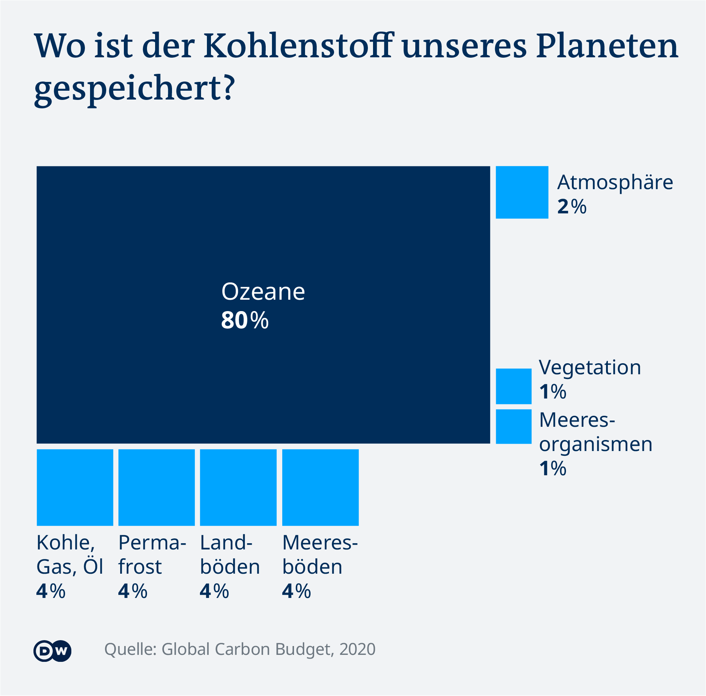

# Natural Sinks

_Idea:_  [Michel Penke](https://michelpenke.de)\
_Research, data analysis and data visualization:_  [Michel Penke](https://michelpenke.de)\
_Illustration:_ Peter Steinmetz
_Writing:_  [Michel Penke](https://michelpenke.de)

**Read the full articles on DW.com:**
- [XXX](https://www.dw.com/en/xxx)

Climate change continues to accelerate. But natural carbon sinks like plants, soils and oceans curb negative consequences. They absorb surprisingly high amounts of green house gas and help to cool down the atmosphere. Furthermore, we could optimise them and make them more effective in the fight against the climate crisis.

The following text will explain the process behind this story: Which data sources were used, how the analysis was conducted and how the data was visualized.

# Source data

| **Data** | **Source** | **Link** |
| --- | --- | --- |
| Global Carbon Budget | Global Carbon Project (GCP)| [Data](https://www.globalcarbonproject.org/carbonbudget/20/data.htm) / [Explanation](https://essd.copernicus.org/articles/12/3269/2020/)|
| Global Forest Resources Assessment 2020 | Food and Agriculture Organization of the United Nations| [Data](http://www.fao.org/documents/card/en/c/ca9825en)|
| A global framework of soil organic carbon stocks under native vegetation for use with the simple assessment option of the Carbon Benefits Project system | ISRIC / University Wageningen | [Data](https://edepot.wur.nl/484483)|
| Soil organic carbon stocks under native vegetation | Agriculture, Ecosystems & Environment | [Data](https://www.researchgate.net/publication/251520363_Soil_organic_carbon_stocks_under_native_vegetation_-_Revised_estimates_for_use_with_the_simple_assessment_option_of_the_Carbon_Benefits_Project_system)|
| IPCC Special Report: Land use change | IPCC | [Data](https://www.ipcc.ch/site/assets/uploads/2018/03/srl-en-1.pdf)|
| IPCC Guidelines: Forest land| Institute for Global Environmental Studies | [Data](https://www.ipcc-nggip.iges.or.jp/public/2006gl/pdf/4_Volume4/V4_04_Ch4_Forest_Land.pdf)|

# Analysis
### Carbon circulation

The first chart is an illustration made by Peter Steinmetz, designer at DW, based on numbers of the [Global Carbon Budget](https://essd.copernicus.org/articles/12/3269/2020/) in 2020. It visualizes the four most important influential factors for global carbon circulation. Others, such as absorbation through cement industry or emissions by marine biota have been omitted due to their comparativ little impact. 

_Caveats: As mentioned above, some sources of emissions and natural sinks have been ignored, such as rivers, coasts and permafrost, for two reasons: Either their influence on the global carbon circle is very low or their net balance is zero._

### Carbon dioxid emissions and sinks balance

The chart about the global emissions and sinks balance is based on [GCP Data](https://www.globalcarbonproject.org/carbonbudget/20/data.htm). While emissions result largely from the burning of fossil fuels, deforestation and other land use changes, the atmosphere, oceans, soils and plants absorb almost all climate greenhouse gases. The more of these are accounted for by the last three natural sinks, the less CO2 and other gases heat up the climate. As can be seen in the graph, the absolute uptake by the sinks has been rising sharply since the middle of the 20th century. However, around 50 percent of the emissions remain in the air. Their absolute amount is also now at a record high. 

_Caveats: The exact amount of emissions and absorbed carbon dioxid are disputed, but only in a small range. The numbers for the historical development of emissions and absorbed green house gas is a synopsis of the global carbon cycle science community. The GCP synthesizes data sets and methodology to quantify the five major components of the global carbon budget and their uncertainties. For reasons of comprehensibility only natural sinks have been included while absorbation through cement production have been ignored. In addition, the cement industry only plays a subordinate role (<2 percent of global emissions). 
The data set states clearly a difference between the estimated total emissions and the estimated changes in the atmosphere, ocean, soil and terrestrial biosphere. While the sum should have been zero, it is not. Due to the GCP, this is the consequence of imperfect data._

### Forests, the living sink

It is true that forests are the fastest absorbing natural sink. But their absorption capacity is severely impaired by deforestation, forest fires and less and less available land. Forests in tropical areas bind the most CO2. The South American Amazon forest, the Congo Basin and the rainforest in Southeast Asia are particularly worthy of mention here. While the forest in Southeast Asia already emits more emissions than it absorbs, the Amazon forest is tipping over these years. Only the vegetation in the Congo is still largely intact and binds more than half a gigatonne of additional CO2 equivalents every year. 

_Caveats: The actual value of the CO2 balance can only be estimated. On the one hand, the bound gases vary depending on plant species, biomass, weather and forest age; on the other hand, the effects of clearings and fires can hardly be recorded with scientific precision. For example, some leading climate scientists ([Harris, 2021](https://www.nature.com/articles/s41558-020-00976-6)) still see the [Amazon as a minor sink](https://www.wri.org/insights/forests-absorb-twice-much-carbon-they-emit-each-year) in 2020, while others already see it as a [net source of emissions](https://www.nature.com/articles/s41586-021-03629-6.epdf?sharing_token=0u1g-DK-9TTcGxnb27EwP9RgN0jAjWel9jnR3ZoTv0NILaci0q8CXtVe4JKM-xF0Z0ZQpmJpnpSclAjJeIV-vCjviXK_Mb9hvvU5C3CiJVgu82-RGuHR01gFiQZAVMzDCCxiRyvlh0MBQxTvGN2oHmf2jIOC7MEEGXrOPGIblsh57v9qXkkZbM7U0OH8zbdQ4jnVO1zD9R1jeDcUVBS22YVLkjWEvC5vrNMdQ416fmEBL9kIHYs2ptVibFKXLxEuh-TQ08w-QGSFzN6221KgguUCOKY25QLN0jHhOGWaJL5Fz6opjvEBGKgucdnPmfUDaOJAN8v0r-u0A-6lhvzIXA%3D%3D&tracking_referrer=www.theguardian.com)._

### Soils, the underrated sink

Soils and their capacity to store CO2 are often underestimated in favour of forests. Yet moist, cold soils in particular can store many times that of vegetation, according to [ISRIC (Batjes, 2011)](https://www.researchgate.net/publication/251520363_Soil_organic_carbon_stocks_under_native_vegetation_-_Revised_estimates_for_use_with_the_simple_assessment_option_of_the_Carbon_Benefits_Project_system). Wetlands such as swamps and bogs in particular store enormous amounts of unrotted plant remains. Since plant parts fall into shallow water bodies and are hardly decomposed there under exclusion of air in acidic water, only little carbon escapes into the atmosphere. Other soils, such as deserts or arable land, have much lower values. However, the amount of carbon in peatlands grows much more slowly per year than the plant sink can absorb.

_Caveats: The exact amount of absorbed carbon dioxid by soil type are disputed. The figures on which the graph is based come from the IPCC for 59 soil types from 2006, some of which have been selected and visualised for illustrative purposes. The values are medians of different measurements. These figures were repeatedly criticised by the scientific community in subsequent years. For example, there are deviating measurements ([Batjes, 2011](https://www.researchgate.net/publication/251520363_Soil_organic_carbon_stocks_under_native_vegetation_-_Revised_estimates_for_use_with_the_simple_assessment_option_of_the_Carbon_Benefits_Project_system)) whose scatter for individual soil types ranges from -42 percent to +244 percent. Since the IPCC figures are discussed, but are still used as a basis for international studies, they were given priority over other studies. Furthermore, competing measurements tend to show that the storage capacity of soils is rather underestimated by the IPCC, which would only further support the statement made in the article and graph._

### Oceans, the slow giant sink

To understand the enormous importance of the ocean for the global climate, consider the graph below, which shows the world's natural stores of CO2. While soils, vegetation and others account for relatively little mass of carbon, the ocean stores 80 per cent of the total. Most of it sinks slowly into deeper and deeper layers of water in the inorganic form of dissociated ions. Since the ocean needs about 1000 years to completely mix its water once, all carbon ever released by humans into the atmosphere and now dissolved in the ocean is still in the top 1000 metres. The data for proportions of natural sinks are taken from the [GCP Report 2020](https://essd.copernicus.org/articles/12/3269/2020/). 

_Caveats: Some smaller sinks, such as rivers, were not visualised in the graph because their share is too small to be shown vividly._
